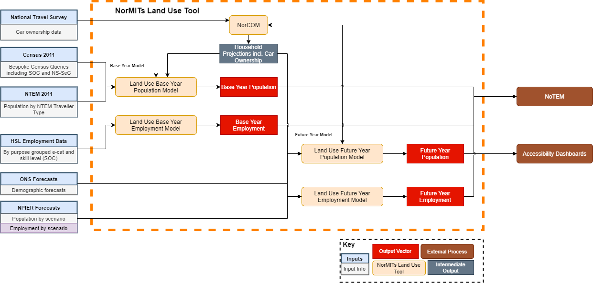

NorMITS Land Use
################

Introduction
============

NorMITs Land Use is Transport for the North's (TfN) mainland GB population and 
employment model. It builds detailed population and employment vectors for a 
given base year, and can also build a range of scenario specific forecasts.

We are open to collaboration and sharing of outputs,
see `support <Sharing>`_ for more information.

.. contents:: Contents
   :depth: 2

   
Summary
=======

NorMITs Land Use breaks down into five models, each with smaller substeps.
Specifically:

- `Base Year Population Model`_ - Synthesises a highly segmented GB population, 
  by person in household.
- `Base Year Employment Model`_ - Synthesises a GB employment profile, including 
  employment types and skill levels.
- `Future Year Population Model`_ - Forecasts a future GB population, by base 
  segmentation.
- `Future Year Employment Model`_ - Forecasts a future GB employment profile, by
  base segmentation.
- `Northern Car Ownership Model`_ - A collection of tools for manipulating 
  matrices that underpins much of the work done by TMS and EFS.

NorMITs Land Use is designed to be modular, in that it should be possible to swap out
units of functionality to provide a desired modelling outcome.

Quick Start Guide
=================

To be written.

Required Data
=============

The NorMITS Land Use Base Land Use tool was initially designed to be able to run 
with publically available data.
Specifically, 2011 Census data and mid-year population estimates provide the 
core of the population model.
As the model has improved, we have integrated other datasets that may be harder 
to access; NTEM data and OS Addressbase, for example.

Base year employment figures used in the model have come from Health and Safety Laboratory and are 
restricted to TfN and partner use.
However, this model could easily be adapted to used freely available employment data 
from the University of Durham's 
`NoMIS data portal <https://www.nomisweb.co.uk/query/select/getdatasetbytheme.asp?opt=3&theme=&subgrp=>`_.

Core forecasts come from NPIER population and employment forecasts, with ONS forecasts providing demographic detail.
This is currently fairly flexible, improvements will be made to ensure the tool is robust whichever forecast vectors it has to deal with.

For more information on how to get hold of this data, please see the `sharing <Sharing Requests_>`_ section.

Base Year Population Model
--------------------------

Base year population model is designed to:

- Build an accurate, multi-dimensional population model for a given census year (default 2011)
- Adjust this to a specified base year, using observed population data (default 2018)

*Inputs*

- Segmented 2011 Census data, bespoke census queries
- Mid-year population estimates

*Outputs*

- Base year population model provides detailed zonal populations (at `MSOA <https://data.gov.uk/dataset/2cf1f346-2f74-4c06-bd4b-30d7e4df5ae7/middle-layer-super-output-area-msoa-boundaries>`_).

Segmentation is an enhancement to the NTEM 88 Traveller Type segmentation, 
which adds employment skill level to person characteristics and 
a household income proxy (Ns-SeC) for the household reference person to 
household characteristics, giving 760 unique traveller types.
Units are in people, households are also provided as a secondary output.

Base Year Employment Model
--------------------------

Base year employment model is simple model designed to:

- Overlay an employment vector, segmented by e-category, by skill level

*Inputs*

- Employment by e-category
- Employment by skill level

*Outputs*

- Employment by e-category and skill level

Future Year Population Model
----------------------------

Future year population model is a model designed to:
- Grow (or shrink) zonal population to a given future year
- Work flexibly with various scenarios
- Apply variable assumptions around demography, car-ownership etc

*Inputs*

- Base year population
- NPIER pop change
- NorCOM car ownership forecasts
- ONS demography change

*Outputs*

- Future year population, segmented as `base <base-year-population-model>`_

Future Year Employment Model
----------------------------

Future year employment model is a model designed to:

- Grow (or shrink) zonal employment to a given future year
- Apply various scenarios

*Inputs*

- Base year employment
- NPIER emp change

*Outputs*

- Future year employment, segmented as `base <Base Year Employment Model_>`_

Northern Car Ownership Model
============================

The (**NorCOM**) takes data from 2011 Census and 
(`National Travel Survey <https://www.gov.uk/government/collections/national-travel-survey-statistics>`_)
to build a prototypical sample of car ownership patterns for Great Britain.
It then builds and applies models to give zonal distributions of car ownership 
for a given base population year.

*Inputs*

- Census Car Ownership data 2011
- National Travel Survey
- Any year population 

*Outputs*

- Base or future year car ownership patterns
- Household and property type counts

Documentation
=============

Current code documentation can only be found in the codebase.
Planned improvements include hosting this online, so it's easily accessible!
Development reports and technical notes are available on request through 
TAME's `Sharing Requests <Sharing>`_ process.

Planned Improvements
====================

This section is a work in progress and will be updated with more detail.
Planned updates include:

- Online hosting of documentation
- Base Year Land Use

  - Toggle to run with fully open data
  - Implement new area type methodology (clustering algorithm)

- Future Year Land Use

  - Integrated TEMPro aligned pop/emp forecasts

- NorCOM
  
  - More granular modelling, new models by area type

Sharing
=======

TfN's Technical Assurance, Modelling and Economics (**TAME**) team have done
a great deal of work to develop TfN’s Analytical Framework.
We aim to develop in a way that provides the best possible value to our Northern partners, 
including making
models and outputs available for local and non-TfN pan-northern schemes and research.

Sharing Models
--------------

We've categorised out ways of sharing into 3 different profiles, each with a distinct 
risk/reward profile.  

1. Utilisation of Open Source tools and casual TfN support.
^^^^^^^^^^^^^^^^^^^^^^^^^^^^^^^^^^^^^^^^^^^^^^^^^^^^^^^^^^^

This includes forking our repository and mostly working without TfN support.
This profile would be facilitated though submitting issues and TfN clarification
supporting where possible.

2. TfN Builds outputs *for* requester
^^^^^^^^^^^^^^^^^^^^^^^^^^^^^^^^^^^^^

Data requests will be submitted using the `Sharing Requests <Sharing>`_ process.
TfN will then assess the feasibility, and aim to build and hand over the
required outputs.

3. TfN Builds outputs *with* requester 
^^^^^^^^^^^^^^^^^^^^^^^^^^^^^^^^^^^^^^

Data requests will be submitted using the `Sharing Requests <Sharing>`_ process.
TfN will then assess the feasibility, and a discussion will begin to decide how
best to work together to produce the required output.

Sharing Requests
----------------

If you are interested in acquiring any of the data, or would like some support
in utilising NorMITs Land Use, please submit your requests to
data.requests@transportforthenorth.com.

All requests should contain the following information:

- Requestor Name
- Requestor Organisation
- Request Date
- Required by date
- Expected deliverables
- Format required, where possible
- Purpose of data
- Will data be published?
- Comments

Please note that the TAME team are in high demand with limited resources so
responses to requests may not be immediate.
However, the team will endeavour to provide you with an estimate of how long
it would take to share the data.

Contents
========

.. toctree::
   :maxdepth: 2
   
   quick_start
   population
   reference
   base_model_structure
